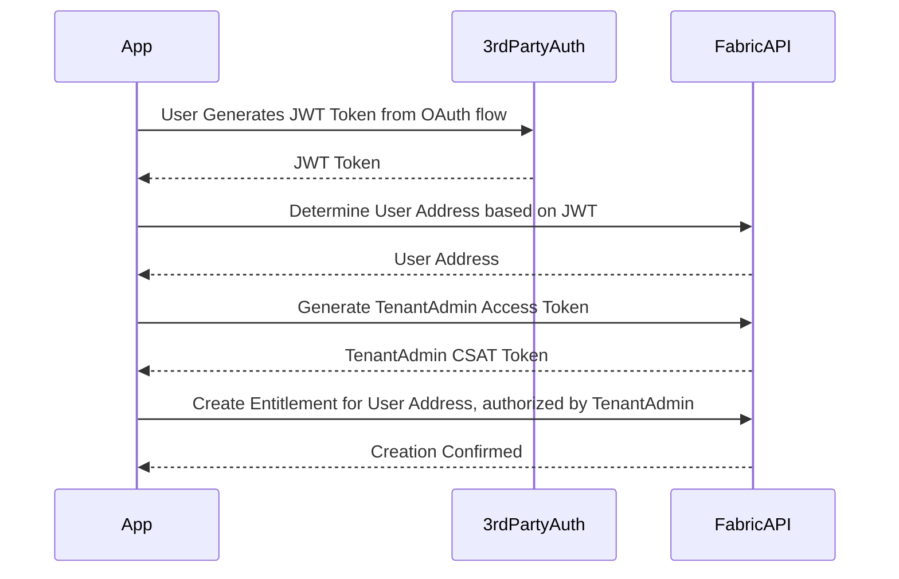
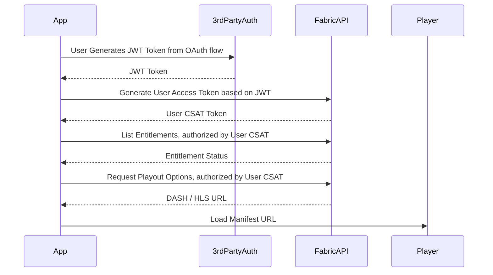

# Sample API

This API document explains how to:

* Authenticate users
* Create, list/verify, and revoke entitlements
* Retrieve media playout URLs (DRM and non-DRM)
* Integrate with standard video players

---

# Quick Start

To entitle a user to content, follow this flow:

To play content for an entitled user, follow this flow:

---

# API Modules

## Authentication

### [User Access Token API](./user-access-token-api.md)

Generates a **CSAT (Client Signed Access Token)** using a trusted JWT.

Use this API to:

* Log users into Fabric
* Retrieve wallet address
* Obtain a UserAuth token for secured API calls
* Enforce token concurrency limits

---

## Entitlements

### [Create Entitlement API](./entitlement-create-api.md)

Creates an entitlement after a verified purchase or rental.

Use cases:

* Third-party payment confirmation
* Rental window enforcement
* Purchase unlocks

---

### [List Entitlements API](./entitlement-listing-api.md)

Lists all entitlements in a user's wallet.

Supports:

* Pagination
* Filtering
* Sorting
* Verification before playback

---

### [Revoke Entitlement API](./entitlement-listing-api.md)

Revoke an entitlement in a user's wallet.

---

## Media Playback

### [Title Playout Clear API](./playout-clear-api.md)

Retrieves **non-DRM (clear)** playback URLs.

Returns:

* DASH manifest
* Optional HLS URL

Best for:

* Non-protected content
* Open playback environments

---

### [Title Playout DRM API](./playout-drm-api.md)

Retrieves **Widevine DRM-protected** playback URLs.

Returns:

* DASH Widevine manifest
* License server URL

Best for:

* Premium content
* Secure playback environments
* DRM-capable players (e.g., ExoPlayer)
