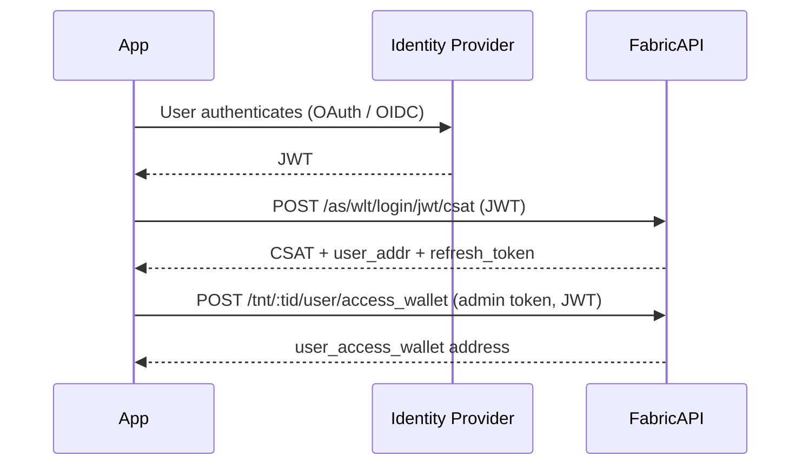

# Authentication

These APIs cover user session management for tenant-integrated applications: exchanging a trusted JWT for a Fabric user access token (CSAT), refreshing that token without re-login, and managing user access wallets.

---

## Quick Start: Auth Flow

The resulting CSAT is the bearer token used for all subsequent entitlement and playout API calls.

---

## APIs

### [Generate User Access Token](./user-access-token.md)

Exchanges a trusted JWT for a Fabric CSAT (Client Signed Access Token).

- Resolves the user's wallet address
- Returns a `refresh_token` for session renewal
- Enforces per-tenant token concurrency limits

### [Refresh Token](./refresh-token.md)

Obtains a new CSAT from an existing refresh token, without requiring the user to re-authenticate.

### [Create User Access Wallet](./create-user-wallet.md)

Provisions an on-chain access wallet for a user and adds them to the tenant's user group. Required before entitlement operations can be performed for a user.

### [Get User Info](./get-user-info.md)

Returns the caller's wallet address, access wallet status, tenant group membership, and admin role flags.
