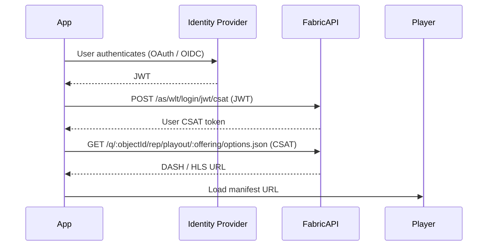

# Media Playback

These APIs retrieve playback URLs for media items after a user's entitlement has been verified. The same endpoint
serves both clear and DRM-protected content -- the response keys differ based on the content protection configured
for the offering.

---

## Quick Start: Playout Flow

---

## APIs

### [Clear Playback](./clear.md)

Retrieves **non-DRM** playback URLs (DASH and optional HLS) for unprotected content or open playback environments.

### [DRM Playback](./drm.md)

Retrieves **Widevine DRM-protected** playback URLs plus the license server URL for premium content requiring secure playback.

---

## Reference

### [Authorization Errors](./errors.md)

How to distinguish geo-restriction failures from entitlement failures.
(Interpretting the 403 status error body.)

### [VOD ABR Ladder Specification](./abr-ladder.md)

Bandwidth and resolution targets for HEVC encoding across SDR, HDR, and MV-HEVC profiles at standard and high frame rates.
