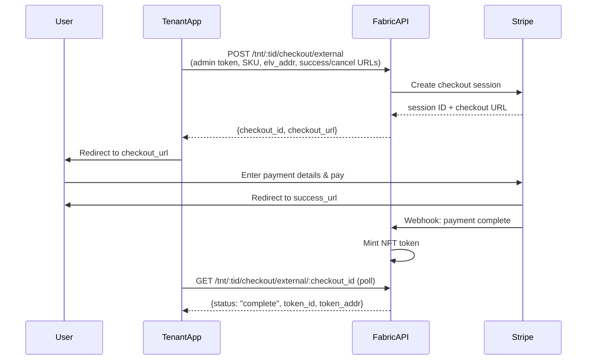
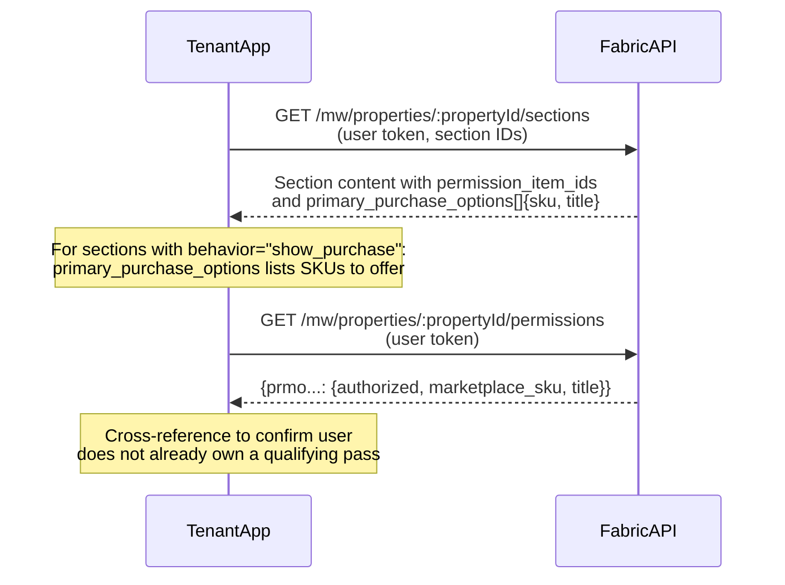
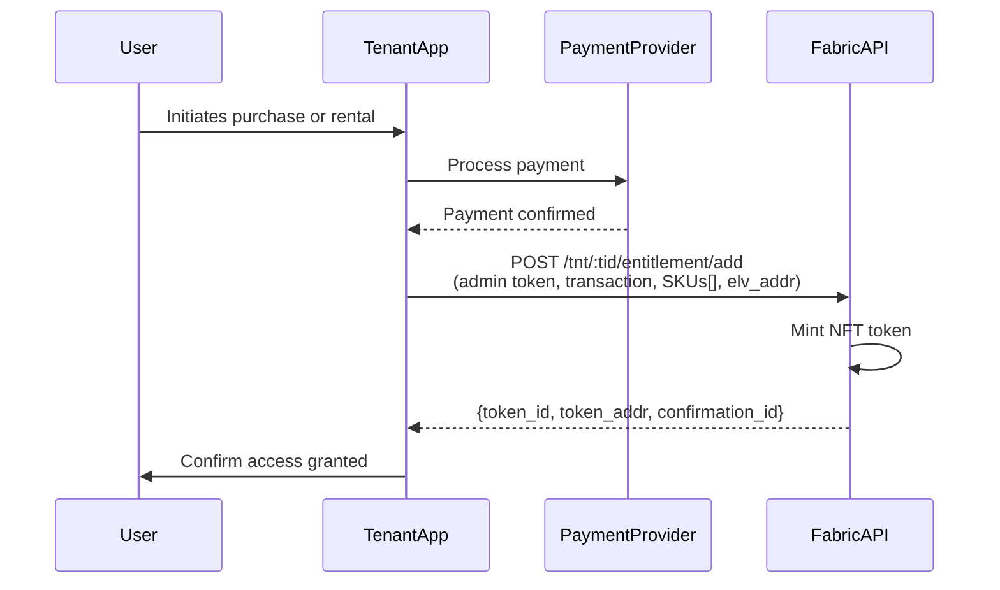

# Purchase & Entitlement Paths

The Eluvio Content Fabric supports several ways for tenants and affiliates to grant users access to content. Each path suits a different integration model.

For Media Wallet API reference (authentication, section/content APIs, schemas), see **[Media Wallet](../README.md)**.

---

## Choosing a Path

| Path | Best for | Who handles payment |
|---|---|---|
| [Hosted Checkout](hosted-checkout/README.md) | Stripe checkout without building payment UI | Eluvio (Stripe-hosted) |
| [Entitlements API](entitlements/README.md) | Fulfillment from any external payment system | Tenant |

---

## Hosted Checkout

Tenant app redirects the user to an Eluvio-hosted Stripe checkout page. On payment completion, the fabric mints an NFT token and the tenant polls for status.

### Discovering What to Purchase

Before initiating a purchase, your app needs to know which SKU gates the content a user wants to access. Use the Sections API to discover this:

See [Hosted Checkout — Discovering SKUs](hosted-checkout/README.md#discovering-which-sku-to-purchase) for a worked example.

---

## Entitlements API

Tenant submits a fulfilled purchase or rental directly. Supports purchase and rental types with fine-grained rental window control.

