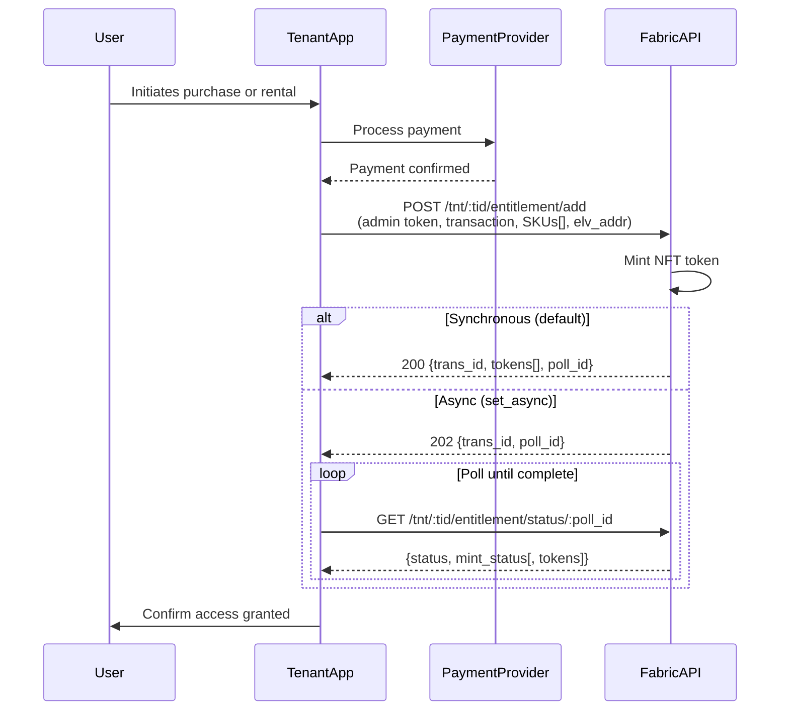

# Entitlements API

Use this path to grant a user access to content by submitting a fulfilled purchase or rental directly to the Eluvio
Authority. Supports purchase and rental types with fine-grained rental window control.

---

## Overview

---

## Endpoints

| Operation               | Endpoint                                        |
|-------------------------|-------------------------------------------------|
| Create entitlement      | `POST /tnt/:tid/entitlement/add`                |
| Poll entitlememt status | `GET /tnt/:tid/entitlement/status/:poll_id`     |
| List entitlements       | `POST /tnt/:tid/entitlement/list/:addr`         |
| Revoke by token         | `POST /tnt/:tid/entitlement/revoke`             |
| Revoke by SKU           | `POST /tnt/:tid/entitlement/revoke_by_sku`      |
| Record watch start      | `POST /tnt/:tid/entitlement/rental/watch_start` |

Authentication: tenant admin bearer token for all operations.

---

## When to Use

- Payment is processed outside Eluvio (any provider)
- You need rental window control (`start_watch`, `active_for`)
- You want entitlement records for reporting and revocation
- You are integrating with a distributor or affiliate system

---

## Supported Transaction Types

| Type     | Description                |
| -------- | -------------------------- |
| purchase | Permanent entitlement      |
| rental   | Time-limited entitlement   |

---

## API Reference

- [Create Entitlement](./create.md) -- submit a purchase or rental after payment confirmation;
  supports sync or async confirmation, see [poll status endpoint](./create.md#poll-entitlement-status)
- [List Entitlements](./list.md) -- retrieve and verify a user's entitlements, with pagination and rental state filtering
- [Revoke Single Entitlement](./revoke.md) -- revoke a specific NFT token by contract address and token ID
- [Revoke Entitlement by SKU](./revoke-by-sku.md) -- revoke all tokens for one or more SKUs from a user's wallet
- [Rental Watch Start](./watch-start.md) -- record when a user first begins watching a rental, anchoring the active window
- [Rental Timing Model](./rental-timing.md) -- describes the Rental Duration and Playback Duration model for rentals
