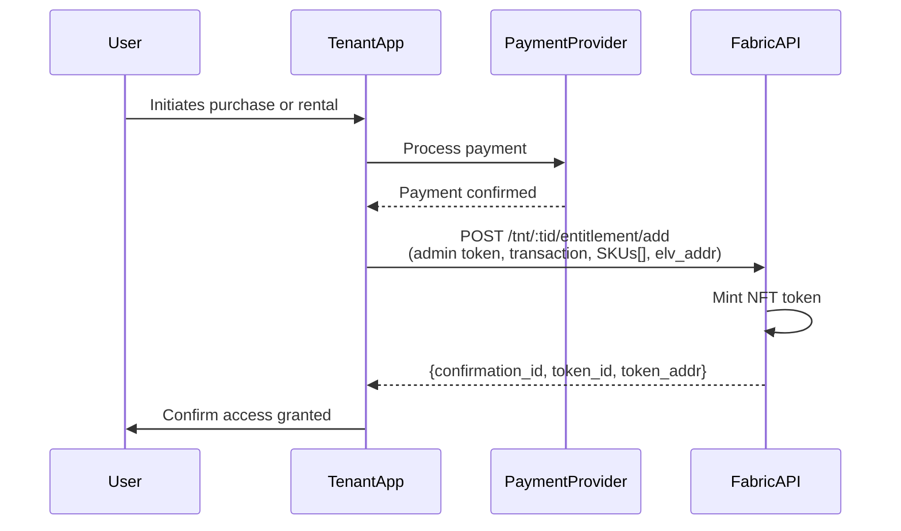

# Entitlements API

Use this path to grant a user access to content by submitting a fulfilled purchase or rental directly to the Eluvio
Authority. Supports purchase and rental types with fine-grained rental window control.

---

## Overview

---

## Endpoints

| Operation | Endpoint |
|---|---|
| Create entitlement | `POST /tnt/:tid/entitlement/add` |
| List entitlements | `POST /tnt/:tid/entitlement/list/:addr` |
| Revoke by token | `POST /tnt/:tid/entitlement/revoke` |
| Revoke by SKU | `POST /tnt/:tid/entitlement/revoke_by_sku` |

**Authentication:** Tenant admin bearer token for all operations.

---

## When to Use

- Payment is processed outside Eluvio (any provider)
- You need rental window control (`start_watch`, `active_for`)
- You want entitlement records for reporting and revocation
- You are integrating with a distributor or affiliate system

---

## Supported Transaction Types

| Type | Description |
|---|---|
| `purchase` | Permanent entitlement |
| `rental` | Time-limited entitlement with configurable window |

---

 Full API reference:

pull in from vub docs tree/main/doc
