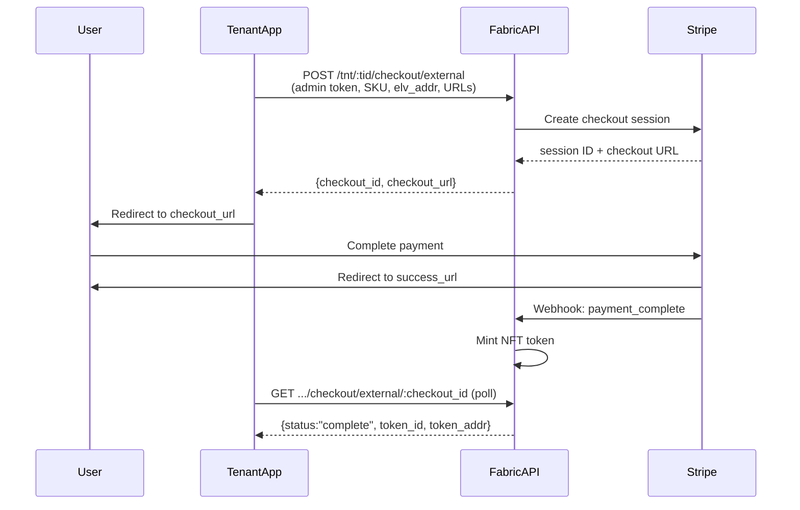

# Hosted Checkout

The Hosted Checkout API lets your application initiate a **Stripe-hosted checkout page** on behalf of a user,
without building any payment UI yourself. Eluvio handles the Stripe session, the webhook, and the NFT mint. You
redirect the user and poll for completion.

---

## Overview



---

## Prerequisites

* A **tenant admin or content admin token** (CSAT) for your tenant
* The **user's wallet address** (`elv_addr`) — your app must know this before checkout
* The **SKU** for the product to purchase (see [Discovering Which SKU to Purchase](#discovering-which-sku-to-purchase))
* Your **success and cancel URLs** — where Stripe redirects after payment

---

## API Reference

### Create a Checkout Session

```
POST /tnt/:tid/checkout/external
```

**Authentication:** Tenant admin or content admin bearer token.

**Path parameters:**

| Parameter | Description |
|---|---|
| `tid` | Your tenant ID |

**Request body:**

| Field | Required | Description |
|---|---|---|
| `sku` | Yes | Product SKU to purchase |
| `elv_addr` | Yes | User's wallet address |
| `success_url` | Yes | URL to redirect user after successful payment |
| `cancel_url` | Yes | URL to redirect user if they cancel |
| `email` | No | User's email address (for Stripe receipt) |
| `country_code` | No | ISO 3166-1 alpha-2 country code of the buyer (e.g. `"US"`) — used for correct currency selection |

**Response:**

| Field | Description |
|---|---|
| `checkout_id` | Stable session identifier (`elvs_...`) — store this to poll status |
| `checkout_url` | Full Stripe-hosted checkout URL — redirect the user here |

**Example:**

```bash
curl -s -X POST \
  -H 'Content-Type: application/json' \
  -H 'Accept: application/json' \
  -H 'Authorization: Bearer <admin-token>' \
  "https://<fabric-authority-url>/tnt/<tid>/checkout/external" \
  -d '{
    "sku": "C9Zct19CoEAZYWug9tyavX",
    "elv_addr": "0x761f45287ea364db6b216bd655910430afa3e839",
    "success_url": "https://your-app.com/success",
    "cancel_url": "https://your-app.com/cancel",
    "country_code": "US"
  }' | jq
```

```json
{
  "checkout_id": "elvs_WxtTe1TiPBbGHdZgqPNM7C",
  "checkout_url": "https://checkout.stripe.com/c/pay/cs_live_a1..."
}
```

---

### Poll Checkout Status

```
GET /tnt/:tid/checkout/external/:checkout_id
```

**Authentication:** Tenant admin/content admin token, **or** the purchasing user's CSAT token.

**Path parameters:**

| Parameter | Description |
|---|---|
| `tid` | Your tenant ID |
| `checkout_id` | The `checkout_id` returned from the create call |

**Response fields:**

| Field | Description |
|---|---|
| `checkout_id` | Session identifier |
| `status` | `"pending"` \| `"complete"` \| `"failed"` |
| `sku` | The SKU purchased |
| `elv_addr` | The buyer's wallet address |
| `extra` | Present on `"complete"` — contains minted token details |

**Status: pending**

```json
{
  "checkout_id": "elvs_WxtTe1TiPBbGHdZgqPNM7C",
  "status": "pending",
  "sku": "C9Zct19CoEAZYWug9tyavX",
  "elv_addr": "0x761f45287ea364db6b216bd655910430afa3e839"
}
```

**Status: complete**

```json
{
  "checkout_id": "elvs_WxtTe1TiPBbGHdZgqPNM7C",
  "status": "complete",
  "sku": "C9Zct19CoEAZYWug9tyavX",
  "elv_addr": "0x761f45287ea364db6b216bd655910430afa3e839",
  "extra": {
    "0": {
      "token_addr": "0x59267d3eff5a4a595f6bfb790d18ed6af358653a",
      "token_id": "1030",
      "token_id_str": "1030"
    },
    "status": "complete"
  }
}
```

---

## Discovering Which SKU to Purchase

Before creating a checkout session, your app needs to know which SKU gates the content the user wants. Use the Sections API:

### 1. Fetch sections (with user token)

```bash
curl -s \
  -H 'Authorization: Bearer <user-token>' \
  "https://<fabric-authority-url>/mw/properties/<propertyId>/sections" \
  -d '["<sectionId>"]' | jq
```

Sections with `permissions.behavior = "show_purchase"` have a `primary_purchase_options` array listing SKUs the user can buy to unlock that section:

```json
{
  "permissions": {
    "behavior": "show_purchase",
    "permission_item_ids": ["prmo51rABK9243M66xT3mgDH3P"],
    "primary_purchase_options": [
      {
        "permission_item_id": "prmo51rABK9243M66xT3mgDH3P",
        "sku": "C9Zct19CoEAZYWug9tyavX",
        "title": "Season Pass"
      }
    ]
  }
}
```

Individual content items also carry a normalized `permission_item_ids` array regardless of section type.

### 2. Confirm the user does not already own a pass (optional)

```bash
curl -s \
  -H 'Authorization: Bearer <user-token>' \
  "https://<fabric-authority-url>/mw/properties/<propertyId>/permissions" | jq
```

Returns a map of `{ permission_item_id → { authorized, marketplace_sku, title } }`. If `authorized` is `true` for any of the permission items gating the content, the user already has access and no purchase is needed.

---

## Integration Notes

- **Store `checkout_id` before redirecting.** It is returned in the API response; your app should persist it so you can poll status after the user returns from Stripe.
- **Poll with backoff.** The Stripe webhook fires asynchronously after payment. Poll `/checkout/external/:checkout_id` with a short delay (e.g., every 2 seconds for up to 60 seconds).
- **`country_code` reflects the buyer, not your server.** Because this API is called server-to-server, IP-based geolocation would resolve to your server's location. Pass the user's actual country code for correct currency selection.
- **`success_url` and `cancel_url` are your app's URLs.** Stripe redirects the user to these after payment completes or is cancelled. The `checkout_id` is not automatically appended — your app already has it.

---

## Samples

Shell samples are in [samples_sh/](samples_sh/).
