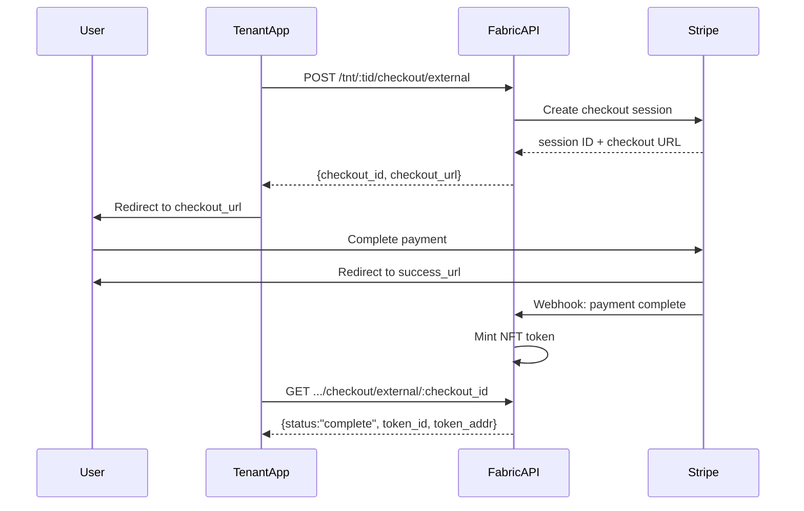

# Hosted Checkout

The Hosted Checkout API lets your application initiate a Stripe-hosted checkout page on behalf of a user, without
building any payment UI yourself.  Eluvio handles the Stripe session, the webhook, and the NFT mint. You redirect
the user and poll for completion.

---

## Overview



---

## Prerequisites

* A tenant admin or content admin token (CSAT) for your tenant
* The user's wallet address (`elv_addr`) -- your app must know this before checkout
* The SKU for the product to purchase (see [Discovering Which SKU to Purchase](#discovering-which-sku-to-purchase))
* Your success and cancel URLs -- where Stripe redirects after payment

---

## API Reference

### Create a Checkout Session

```
POST /tnt/:tid/checkout/external
```

#### Authentication

Tenant admin or content admin bearer token.

#### Path Parameters

| Parameter | Description    |
|-----------|----------------|
| `tid`     | Your tenant ID |

#### Request Body

| Field          | Required | Description                                   |
|----------------|----------|-----------------------------------------------|
| `sku`          | Yes      | Product SKU to purchase                       |
| `elv_addr`     | Yes      | User's wallet address                         |
| `success_url`  | Yes      | URL to redirect user after successful payment |
| `cancel_url`   | Yes      | URL to redirect user if they cancel           |
| `email`        | No       | User's email address (for Stripe receipt)     |
| `country_code` | No       | Buyer country code (e.g. `"US"`)              |

#### Response

| Field          | Description                                                  |
|----------------|--------------------------------------------------------------|
| `checkout_id`  | Session identifier (`elvs_...`) -- store this to poll status |
| `checkout_url` | Stripe-hosted checkout URL -- redirect the user here         |

#### Example

```bash
curl -s -X POST -H 'Content-Type: application/json' -H 'Accept: application/json' \
  -H 'Authorization: Bearer <admin-token>' \
  "https://<authority-url>/tnt/<tid>/checkout/external" \
  -d '{
    "sku":          "<sku>",
    "elv_addr":     "<user-wallet-address>",
    "success_url":  "https://your-app.com/success",
    "cancel_url":   "https://your-app.com/cancel",
    "country_code": "US"
  }' | jq
```

```json
{
  "checkout_id":  "elvs_...",
  "checkout_url": "https://checkout.stripe.com/c/pay/cs_live_..."
}
```

---

### Poll Checkout Status

```
GET /tnt/:tid/checkout/external/:checkout_id
```

#### Authentication

Tenant admin or content admin token, or the purchasing user's CSAT token.

#### Path Parameters

| Parameter     | Description                                     |
|---------------|-------------------------------------------------|
| `tid`         | Your tenant ID                                  |
| `checkout_id` | The `checkout_id` returned from the create call |

#### Response Fields

| Field         | Description                                           |
|---------------|-------------------------------------------------------|
| `checkout_id` | Session identifier                                    |
| `status`      | `"pending"` \| `"complete"` \| `"failed"`             |
| `sku`         | The SKU purchased                                     |
| `elv_addr`    | The buyer's wallet address                            |
| `extra`       | Present on `"complete"` -- contains minted token info |

#### Status: pending

```json
{
  "checkout_id": "elvs_...",
  "status":      "pending",
  "sku":         "<sku>",
  "elv_addr":    "<user-wallet-address>"
}
```

#### Status: complete

```json
{
  "checkout_id": "elvs_...",
  "status":      "complete",
  "sku":         "<sku>",
  "elv_addr":    "<user-wallet-address>",
  "extra": {
    "0": {
      "token_addr":   "<contract-address>",
      "token_id":     "<token-id>",
      "token_id_str": "<token-id>"
    },
    "status": "complete"
  }
}
```

---

## Discovering Which SKU to Purchase

The Sections API returns everything needed in a single call. Each gated
section or content item includes a `primary_purchase_skus` array with the
SKUs the user can buy, resolved server-side from the property's permission
configuration.

```bash
curl -s \
  -H 'Authorization: Bearer <user-token>' \
  "https://<authority-url>/mw/properties/<propertyId>/sections" \
  -d '["<sectionId>"]' | jq
```

### Section-gated content

`primary_purchase_skus` appears on `section.permissions`:

```json
{
  "permissions": {
    "behavior": "show_purchase",
    "permission_item_ids": ["<permission_item_id>"],
    "primary_purchase_skus": [
      {
        "permission_item_id": "<permission_item_id>",
        "sku":   "<sku>",
        "title": "<pass name>"
      }
    ]
  }
}
```

### Item-gated content

`primary_purchase_skus` can appear on each content item.
Multiple entries appear when several passes each grant access:

```json
{
  "media_id": "<media_id>",
  "permission_item_ids": ["<permission_item_id_1>", "<permission_item_id_2>"],
  "primary_purchase_skus": [
    {
      "permission_item_id": "<permission_item_id_1>",
      "sku":   "<sku_1>",
      "title": "<pass name>"
    },
    {
      "permission_item_id": "<permission_item_id_2>",
      "sku":   "<sku_2>",
      "title": "<pass name>"
    }
  ]
}
```

`primary_purchase_skus` only contains passes the user does not yet own.  If the array is absent or empty, the user
already has access. When multiple options are present, the app selects the appropriate one for the user.

---

## Integration Notes

### Store `checkout_id` before redirecting

Your app should persist it so you can poll status after the user returns from Stripe.

### Poll with backoff

The Stripe webhook fires asynchronously. Poll every 2-3 seconds for up to 60 seconds after the user returns from the
Stripe redirect.

### `country_code` reflects the buyer, not your server

This API is called server-to-server, so IP geolocation resolves to your server's location. Pass the buyer's actual
country code for correct currency selection.

### `success_url` and `cancel_url` are your app's URLs

Stripe redirects the user there after payment completes or is cancelled.  The `checkout_id` is not appended
automatically -- your app already has it from the create response.

---

## Samples

Shell samples are available in [samples_sh/](samples_sh/).
