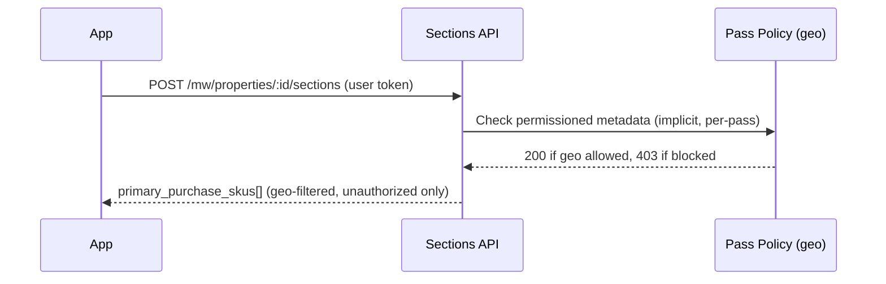

# Discovering What to Purchase

When a user cannot play content, the tenant app needs to determine what pass or SKU to offer them.
This document covers how to find the right purchase option and how geo restrictions affect what is shown.

---

## Trigger: Detecting a Missing Entitlement

A playback attempt returns HTTP 403. Classify the error to decide what to show the user:

```javascript
function classifyPlayoutError(response) {
  const s = JSON.stringify(response);
  if (s.includes("ipGeoLocationProps")) return "geo-blocked";
  if (s.includes("isOwnerOfLinkedNft"))  return "no-entitlement";
  return "unknown";
}
```

- `"geo-blocked"` --> content is not available in this user's region; show the regional availability message
- `"no-entitlement"` --> user needs to purchase a pass; proceed with discovery below

See [Playout Authorization Errors](../playout/errors.md) for the full error structure.

---

## Sections API: Finding the Right SKU

The walletv2 Sections API returns `primary_purchase_skus` inline on any section or content item
the user cannot access. This list is already filtered to SKUs the user does not yet own.

```
POST /mw/properties/:propertyId/sections
Authorization: Bearer <user-token>
Body: ["<sectionId>", ...]
```

Response (abbreviated):

```json
{
  "contents": [
    {
      "id": "pscm...",
      "label": "Season Passes",
      "content": [
        {
          "id": "psci...",
          "type": "item_purchase",
          "primary_purchase_skus": [
            {
              "permission_item_id": "prmo...",
              "sku": "4gMyMXiSmbdqG6ECPTB6mu",
              "title": "URC TV 2025/26 Season Pass"
            }
          ]
        }
      ]
    }
  ]
}
```

`primary_purchase_skus` is set by the server only when both conditions hold:
- The user does not own the permission item (`authorized == false`)
- The permission item has a marketplace SKU configured (`marketplace_sku != ""`)

Pass the SKU directly to [Hosted Checkout](hosted-checkout/README.md) or the
[Entitlements API](entitlements/README.md).

---

## Geo Restriction: How Passes Are Filtered by Region

Tenants with geo-restricted content configure separate permission items per region
(e.g. "Rest of World", "Ireland", "Canada", "Italy"). Each permission item references a
pass that carries a geo policy.

**The filtering happens at the pass's policy level, not in the Sections API:**

1. Each pass is a content object with an access policy that allows only the appropriate region.
2. The Sections API checks the pass's permissioned metadata for the requesting user.
3. If the user's IP is in the allowed region --> pass check succeeds --> `purchaseAuthorized: true` -->
   SKU appears in `primary_purchase_skus`.
4. If the user's IP is in a blocked region --> pass check fails --> `purchaseAuthorized: false` -->
   SKU is omitted from `primary_purchase_skus`.

The result: `primary_purchase_skus` only ever contains passes that the user's geo permits them to buy.
A user in Australia sees the "Rest of World" SKU; a user in Ireland sees the Ireland SKU. Neither
sees the other's options.



---

## When No Passes Are Available

If the user's geo is blocked for all passes, `primary_purchase_skus` will be empty on every
content item. The tenant should detect this and show an appropriate message.

The Eluvio Media Wallet supports a `no_purchase_available_page` configuration on the property,
which is displayed automatically when no purchase options are available. This page is
tenant-configured with custom text, background image, and an external link (e.g. a "Where to
Watch" page listing regional broadcasters).

For native apps that drive the purchase flow themselves, check whether `primary_purchase_skus`
is empty on all gated items after calling the Sections API. If so, redirect the user to the
equivalent regional availability message in your app.

---

## Native App Integration: Wallet URL with Purchase Context

Embedded or native apps (TVs, iOS, Android) typically hand off the purchase flow to the Eluvio Media Wallet
via a URL with a base58-encoded context parameter `p`.

The `p` parameter is a base58-encoded JSON object:

```json
{
  "type": "purchase",
  "id": "<propertyId | pageId | sectionId | sectionItemId | mediaItemId>",
  "sectionSlugOrId": "<sectionId>",
  "sectionItemId": "<sectionItemId>",
  "permissionItemIds": ["<permissionItemId>", ...],
  "secondaryPurchaseOption": "show | only | out_of_stock"
}
```

| Field                               | Purpose                                                          |
|-------------------------------------|------------------------------------------------------------------|
| `type`                              | Always `"purchase"`                                              |
| `id`                                | Broadest-to-most-specific resource ID; last non-null value wins  |
| `permissionItemIds`                 | Explicit list of permission items to offer; skips section lookup |
| `sectionSlugOrId` + `sectionItemId` | Wallet resolves purchase options from the section hierarchy      |
| `secondaryPurchaseOption`           | Controls secondary-market display                                |

The wallet decodes `p`, resolves the relevant permission items, checks `purchaseAuthorized` for
each, and presents only the geo-permitted options. If none are `purchaseAuthorized`, it falls
back to `no_purchase_available_page`.

The `authorization` query parameter carries the user's provider, token, and wallet address so the
wallet can complete the purchase on their behalf without requiring a separate login.
