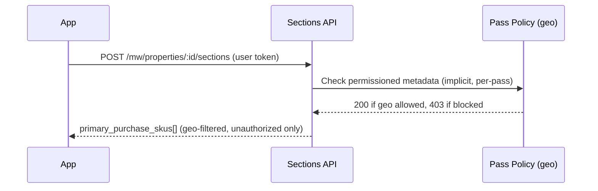
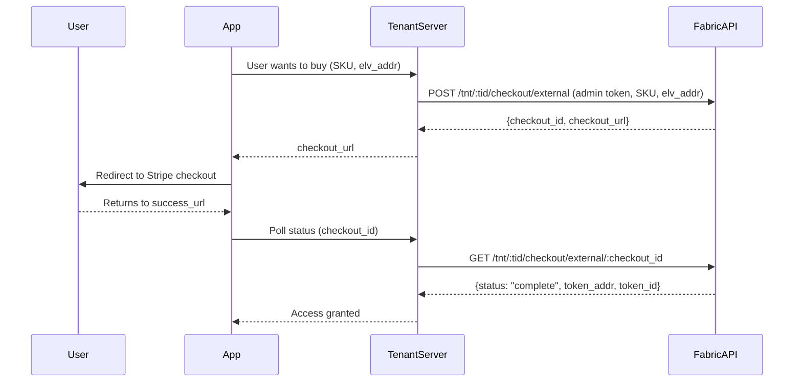

# Discovering What to Purchase

When a user cannot play content, the tenant app needs to determine what pass or SKU to offer them.
This document covers how to find the right purchase option and how geo restrictions affect what is shown.

---

## Trigger: Detecting a Missing Entitlement

A playback attempt returns HTTP 403. Classify the error to decide what to show the user:

```javascript
function classifyPlayoutError(response) {
  const s = JSON.stringify(response);
  const hasGeo = s.includes("ipGeoLocationProps");
  const hasNft = s.includes("isOwnerOfLinkedNft");
  if (hasGeo && !hasNft) return "geo-blocked";
  if (hasNft) return "no-entitlement";
  return "unknown";
}
```

- `"geo-blocked"` --> content is not available in this user's region; show the regional availability message
- `"no-entitlement"` --> user needs to purchase a pass; proceed with discovery below

See [Playout Authorization Errors](../playout/errors.md) for the full error structure.

---

## Sections API: Finding the Right SKU

The Media Wallet `/sections` API returns `primary_purchase_skus` inline on any section or content item
the user cannot access. This list is already filtered to SKUs the user does not yet own.

```
POST /mw/properties/{propertyId}/sections
Authorization: Bearer <user-token>
Body: ["<sectionId>", ...]
```

Response (abbreviated):

```json
{
  "contents": [
    {
      "id": "pscm...",
      "label": "Access Passes",
      "content": [
        {
          "id": "psci...",
          "type": "item_purchase",
          "primary_purchase_skus": [
            {
              "permission_item_id": "prmo...",
              "sku": "SKUABCD1234",
              "title": "Season Pass"
            }
          ]
        }
      ]
    }
  ]
}
```

`primary_purchase_skus` is populated only for permission items the user does not yet own
and that have a purchasable SKU configured in the marketplace.

Pass the SKU directly to [Hosted Checkout](hosted-checkout/README.md) or the
[Entitlements API](entitlements/README.md).

---

## Geo Restriction: How Passes Are Filtered by Region

Tenants with geo-restricted content configure separate permission items per region
(e.g. "Rest of World", "Canada", "Italy"). Each permission item references a
pass that carries a geo policy.

**The filtering happens at the pass's policy level, not in the Sections API:**

1. Each pass is a content object with an access policy that allows only the appropriate region.
2. The Sections API checks the pass's permissioned metadata for the requesting user.
3. If the user's IP is in the allowed region --> pass check succeeds --> SKU appears in `primary_purchase_skus`.
4. If the user's IP is in a blocked region --> pass check fails --> SKU is omitted from `primary_purchase_skus`.

The result: `primary_purchase_skus` only ever contains passes that the user's geo permits them to buy.
A user in Australia sees the "Rest of World" SKU; a user in Ireland sees the Ireland SKU. Neither
sees the other's options.



---

## When No Passes Are Available


If the content is gated (for example, a playout request returned HTTP 403) but `primary_purchase_skus` is empty on
every gated content item, then no purchasable passes are available for this user (including the case where all
passes are geo-filtered out).  The tenant should detect this and show an appropriate message.

The Eluvio Media Wallet supports a `no_purchase_available_page` configuration on the property,
which is displayed automatically when no purchase options are available. This page is
tenant-configured with custom text, background image, and an external link (e.g. a "Where to
Watch" page listing regional broadcasters).

For native apps that drive the purchase flow themselves, check whether `primary_purchase_skus`
is empty on all gated items after calling the Sections API. If so, redirect the user to the
equivalent regional availability message in your app.

---

## Initiating Purchase: Hosted Checkout

Once you have a SKU from `primary_purchase_skus`, pass it to the Hosted Checkout API. This is a
server-to-server call using your tenant admin token -- the user never sees the wallet, only your
app's UI and the Stripe checkout page.



See [Hosted Checkout](hosted-checkout/README.md) for the full API reference, request/response
fields, and polling guidance.

> **Note on `country_code`:** The checkout API is called server-to-server, so IP geolocation
> resolves to your server, not the user. Pass the buyer's actual country code for correct currency
> selection.
